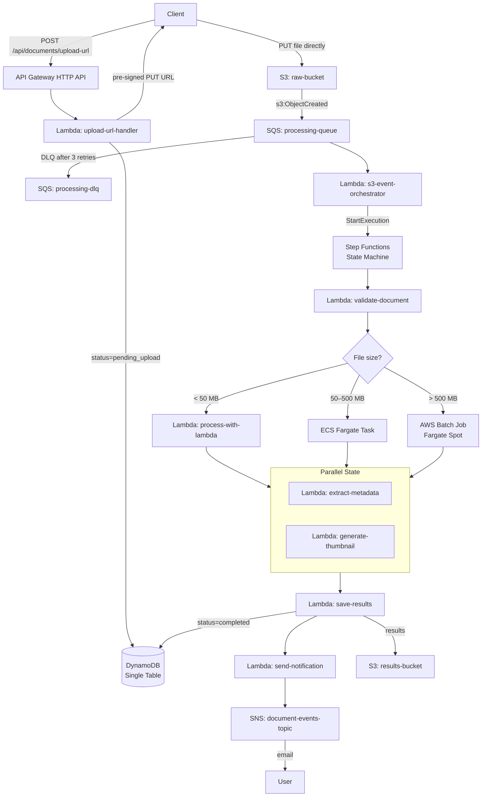

# AWS Document Processing Platform

A production-grade, event-driven document processing platform built on AWS serverless and container infrastructure. Designed to handle documents of any size — from kilobytes to gigabytes — through an intelligent routing pipeline.

## Architecture Overview



## Tech Stack

| Component        | Technology                 |
| ---------------- | -------------------------- |
| Infrastructure   | AWS CDK v2 (TypeScript)    |
| API              | API Gateway HTTP API       |
| Compute (small)  | Lambda (Node.js 20.x)      |
| Compute (medium) | ECS Fargate                |
| Compute (large)  | AWS Batch (Fargate Spot)   |
| Orchestration    | Step Functions             |
| Queue            | SQS + Dead Letter Queue    |
| Storage          | S3 (raw + results)         |
| Database         | DynamoDB (Single Table)    |
| Notifications    | SNS                        |
| Monorepo         | npm workspaces + Turborepo |
| Language         | TypeScript (strict mode)   |

## Prerequisites

```bash
node --version    # v20+
aws --version     # v2.13+
cdk --version     # v2+
docker --version  # v20+
```

Configure AWS credentials:

```bash
aws configure
aws sts get-caller-identity
```

## Quick Start

### 1. Install

```bash
npm install
```

### 2. Bootstrap CDK (one-time per account/region)

```bash
cd infrastructure
cdk bootstrap aws://<YOUR_ACCOUNT_ID>/<YOUR_REGION>
# Example: cdk bootstrap aws://123456789012/us-east-1
```

### 3. Deploy

```bash
cd infrastructure
cdk deploy --all
```

After deploy, API URL is printed as CloudFormation output.

## Development

```bash
# Build all
npm run build

# Run tests
npm run test

# Type-check
npm run typecheck

# Lint
npm run lint
```

Turborepo caches outputs — fast rebuilds.

## API Examples

```bash
# 1. Get pre-signed upload URL
curl -X POST https://<api-url>/api/documents/upload-url \
  -H "Content-Type: application/json" \
  -d '{
    "fileName":"report.pdf",
    "fileSize":1024,
    "mimeType":"application/pdf",
    "userEmail":"user@example.com"
  }'

# 2. Upload file to S3 (using the uploadUrl from step 1)
curl -X PUT "<uploadUrl>" \
  -H "Content-Type: application/pdf" \
  --data-binary @report.pdf

# 3. Check document status
curl https://<api-url>/api/documents/<documentId>
```

## Cleanup

```bash
cd infrastructure
cdk destroy --all
```
