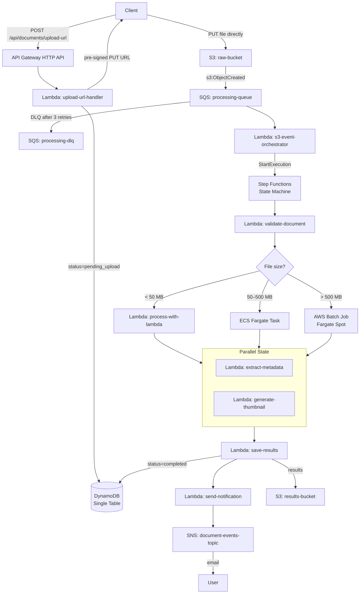

# AWS Document Processing Platform

A production-grade, event-driven document processing platform built on AWS serverless and container infrastructure. Designed to handle documents of any size — from kilobytes to gigabytes — through an intelligent routing pipeline.

## Architecture Overview



## Tech Stack

| Layer                  | Technology                             |
| ---------------------- | -------------------------------------- |
| IaC                    | AWS CDK v2 (TypeScript)                |
| API                    | API Gateway HTTP API                   |
| Compute (small files)  | AWS Lambda (Node.js 20.x)              |
| Compute (medium files) | ECS Fargate                            |
| Compute (large/bulk)   | AWS Batch (Fargate Spot)               |
| Orchestration          | AWS Step Functions (Standard)          |
| Queue                  | SQS + Dead Letter Queue                |
| Storage                | S3 (raw + results buckets)             |
| Database               | DynamoDB (Single Table Design)         |
| Notifications          | SNS                                    |
| Observability          | CloudWatch Logs/Metrics/Alarms + X-Ray |
| Monorepo               | npm workspaces + Turborepo             |
| Language               | TypeScript (strict mode)               |

## Repository Structure

```
aws-document-processing/
├── infrastructure/          # CDK stacks
│   ├── bin/                 # CDK app entrypoint
│   └── lib/                 # Stack definitions
│       ├── storage-stack.ts
│       ├── database-stack.ts
│       ├── messaging-stack.ts
│       ├── api-stack.ts
│       ├── workflow-stack.ts
│       ├── ecs-stack.ts
│       └── batch-stack.ts
├── lambdas/                 # Lambda handlers (one folder = one function)
│   ├── upload-url/
│   ├── get-document/
│   ├── list-documents/
│   ├── download-result/
│   ├── s3-event-orchestrator/
│   ├── validate-document/
│   ├── process-with-lambda/
│   ├── extract-metadata/
│   ├── generate-thumbnail/
│   ├── save-results/
│   ├── send-notification/
│   ├── cleanup-failed-document/
│   ├── bulk-upload/
│   ├── check-batch-status/
│   └── shared/              # Shared utilities and types
├── ecs-worker/              # Docker app for Fargate (50–500 MB files)
│   ├── Dockerfile
│   └── src/
├── batch-worker/            # Docker app for AWS Batch (>500 MB)
│   ├── Dockerfile
│   └── src/
├── tests/                   # Integration and e2e tests
├── package.json             # npm workspaces root
├── turbo.json               # Turborepo pipeline config
├── tsconfig.base.json       # Shared TypeScript config
└── .github/
    └── copilot-instructions.md
```

## File Routing Logic

| File size        | Processor                | Reason                                                                  |
| ---------------- | ------------------------ | ----------------------------------------------------------------------- |
| < 50 MB          | Lambda                   | Fast, cheap, no cold-start penalty for small payloads                   |
| 50 – 500 MB      | ECS Fargate              | More memory/CPU, persistent `/tmp`, no Lambda 15min limit               |
| > 500 MB or bulk | AWS Batch (Fargate Spot) | Cost-optimized (up to 70% discount), designed for heavy batch workloads |

## DynamoDB Access Patterns

Single Table Design with `PK` / `SK` composite key:

| Access Pattern           | PK                           | SK                 |
| ------------------------ | ---------------------------- | ------------------ |
| Get document by ID       | `USER#<email>`               | `DOC#<documentId>` |
| List documents by user   | `USER#<email>`               | `DOC#*` (Query)    |
| Get batch status         | `BATCH#<batchId>`            | `DOC#*` (Query)    |
| Find all processing docs | GSI: `status` = `processing` | —                  |

## Prerequisites

```bash
node --version   # v20+
aws --version    # v2.x
cdk --version    # v2.x
docker --version # v20+
```

AWS credentials configured:

```bash
aws configure
aws sts get-caller-identity  # verify
```

## Getting Started

### 1. Install dependencies

```bash
npm install
```

### 2. Bootstrap CDK (one-time per account/region)

```bash
cd infrastructure
cdk bootstrap aws://501044375484/eu-central-1
```

### 3. Deploy

```bash
cd infrastructure
cdk deploy --all
```

After deploy, the API URL is printed as a CloudFormation output:

```
ApiStack.ApiUrl = https://xxxxxxxx.execute-api.eu-central-1.amazonaws.com
```

### 4. Upload a document

```bash
# Get pre-signed upload URL
curl -X POST https://<api-url>/api/documents/upload-url \
  -H "Content-Type: application/json" \
  -d '{"fileName":"report.pdf","fileSize":1048576,"mimeType":"application/pdf","userEmail":"you@example.com"}'

# Response:
# { "uploadUrl": "https://...", "documentId": "abc-123" }

# Upload the file directly to S3
curl -X PUT "<uploadUrl>" \
  -H "Content-Type: application/pdf" \
  --data-binary @report.pdf

# Check processing status
curl https://<api-url>/api/documents/abc-123
```

## Development

```bash
# Build all packages
npm run build

# Run all tests
npm run test

# Type-check all packages
npm run typecheck

# Lint all packages
npm run lint
```

Turborepo caches task outputs — subsequent runs are instant if nothing changed.

## Infrastructure Stacks

| Stack            | Resources                                                |
| ---------------- | -------------------------------------------------------- |
| `StorageStack`   | S3 raw bucket, S3 results bucket, S3 event notifications |
| `DatabaseStack`  | DynamoDB table, GSI, PITR                                |
| `MessagingStack` | SQS queue, DLQ, SNS topic                                |
| `ApiStack`       | API Gateway HTTP API, routes                             |
| `WorkflowStack`  | Step Functions state machine                             |
| `EcsStack`       | ECS Cluster, Task Definition, ECR                        |
| `BatchStack`     | Batch Compute Environment, Job Queue, Job Definition     |

## Security

- All Lambda functions follow least-privilege IAM (CDK `.grantRead()` / `.grantWrite()`)
- S3 buckets: block all public access, SSE-S3 encryption
- No credentials in code — environment variables injected at runtime by CDK
- `.env` is gitignored

## Cost Estimate (light dev usage)

| Service                           | Estimated / month |
| --------------------------------- | ----------------- |
| Lambda (1M invocations)           | ~$0.20            |
| Step Functions (10K executions)   | ~$0.25            |
| DynamoDB (On-Demand, low traffic) | ~$0.50            |
| S3 (10 GB storage)                | ~$0.23            |
| ECS Fargate (occasional)          | ~$1.00            |
| AWS Batch Fargate Spot            | ~$0.50            |
| **Total**                         | **~$3 / month**   |

## Teardown

```bash
cd infrastructure
cdk destroy --all
```

> **Warning:** S3 buckets with data must be emptied first. DynamoDB table has deletion protection enabled.

## Architecture Decision Records

See [docs/adr/](./docs/adr/) for decisions on:

- CDK over Terraform
- Single Table Design in DynamoDB
- Step Functions Standard over Express
- Lambda / Fargate / Batch routing thresholds
